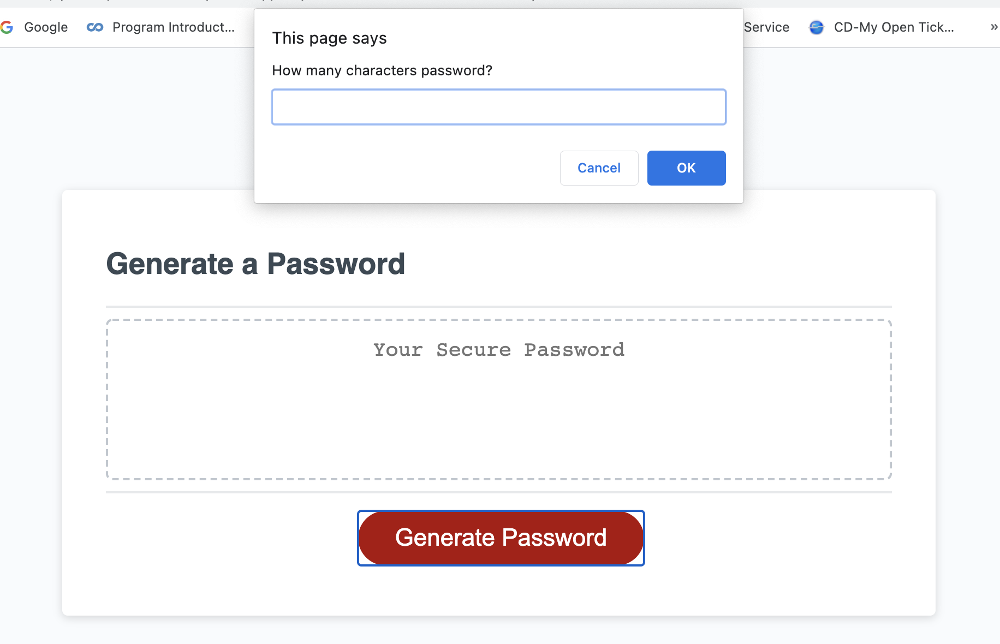

# 03HW-JS-Password-Generator

## Table of Contents
1. [Title](#title)
2. [General Info](#general-info)
3. [Technologies](#technologies)
4. [Installation](#installation)
5. [Collaboration](#collaboration)
6. [Steps](#Steps)

## Title
Personal portfolio

## General Info
The purpose of this task is to create password generator that will produce a password based on the user's input. The user will be prompted ti input length of the password then followed by if they want special characters, uppercase, lowercase, and/or numbers.

## Technologies 
The site uses HTML and CSS code

## Installation
To access the website go to https://melelson.github.io/03HW-JS-Password-Generator/
To clone https://github.com/MelElson/03HW-JS-Password-Generator

# Collaboration 
Pull requests are encouraged. Please make sure to update as appropriate 

# Steps
Steps taken by user
	• User clicks on link and is given a prompt that asks to choose length of password.
	• The user is then prompted if they would like Special Characters. Pressing ok includes. Pressing Cancel omits.
	• The user is then prompted if they would like Uppercase. Pressing ok includes. Pressing Cancel omits.
	• The user is then prompted if they would like Lowercase. Pressing ok includes. Pressing Cancel omits.
    • The user is then prompted if they would like Numbers. Pressing ok includes. Pressing Cancel omits.
	• Once user completes prompts they will click on Generate Password and a password will be created based on random values 
      of the selection they chose within the prompts.
    
### Code

### Website Password Generator

### Example Prompt

### Password showing in text box
